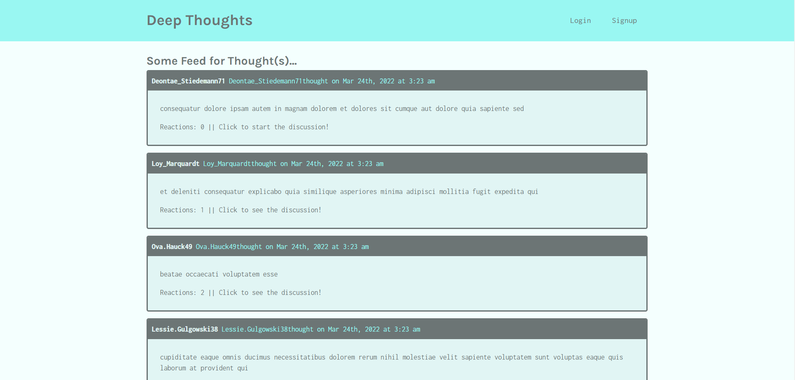
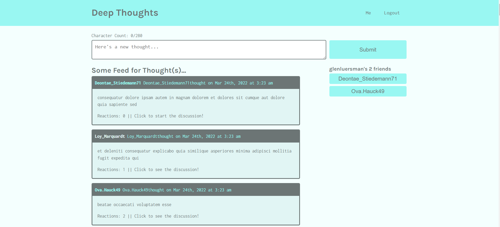
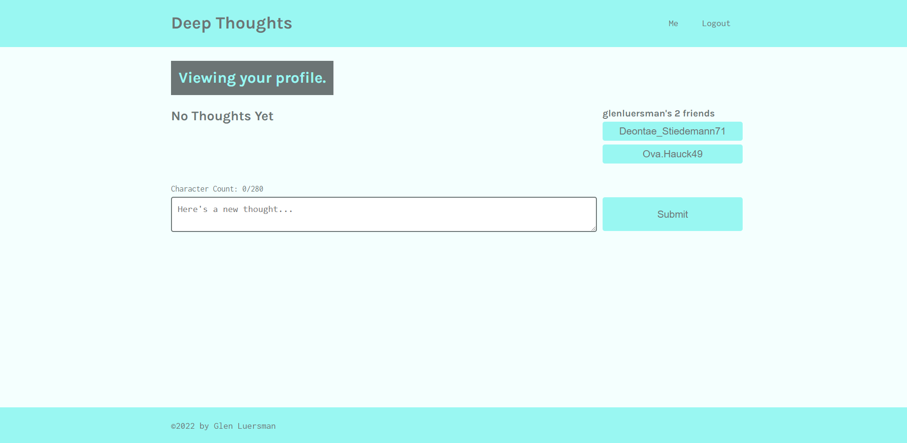
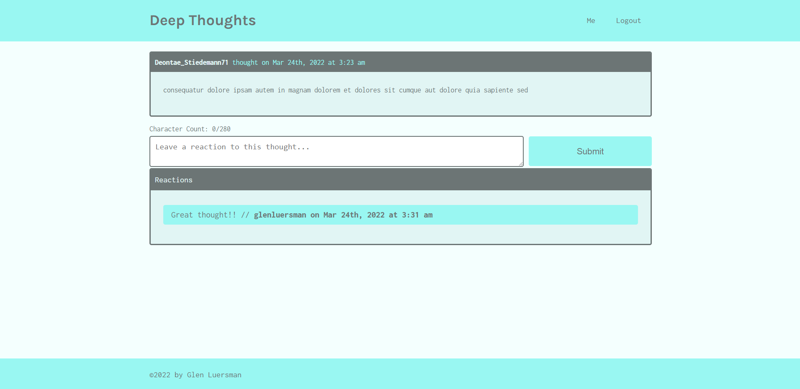

 </a>

<h3 align="center">Deep Thoughts</h3>

---

## 

- [About](#about)
- [Installing](#installing)
- [Usage](#usage)
- [Built With](#built_using)
- [Authors](#authors)
- [Questions](#questions)
- [Screenshots](#screenshots)

## 

- Deep Thoughts is a class module designed to teach the MERN Stack.

## 

- Upon visiting the site you are presented with all the thoughts. After signing up or logging in you are able to add thoughts, reactions, and friends.

## 

- MongoDB
- Express.js
- React
- Node.js

## 

- [glenluersman](https://github.com/glenluersman)

## 

- Feel free to open an issue or contact me directly at glen.luersman@gmail.com if you have any questions about the repo. You can find more of my work at [glenluersman](https://github.com/glenluersman/).

## 

Deployed At Heroku: https://boiling-taiga-51507.herokuapp.com/

</a>

</a>

</a>

</a>